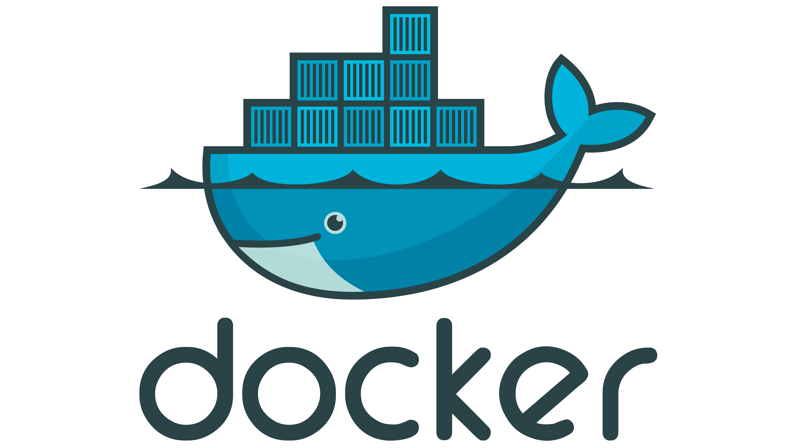
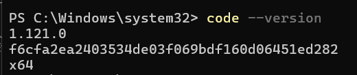
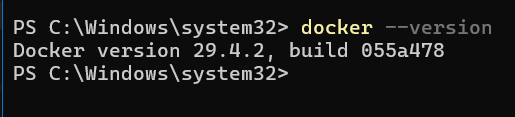
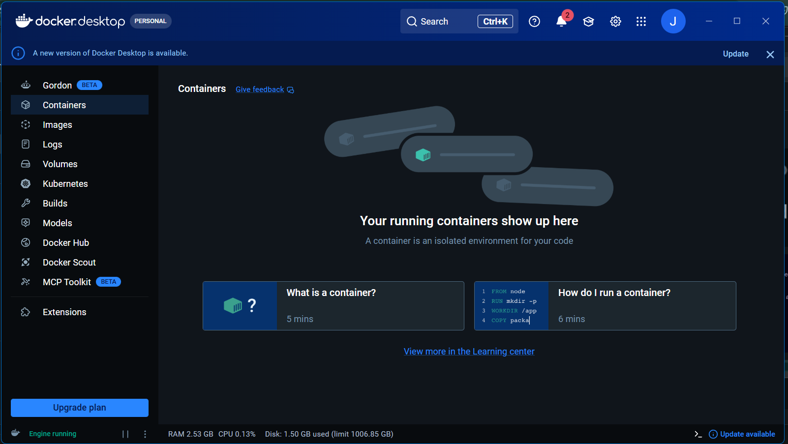
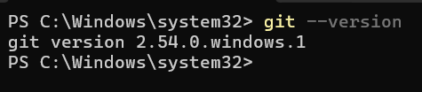
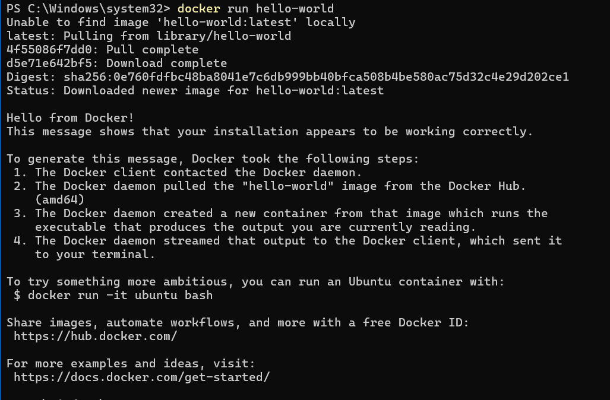
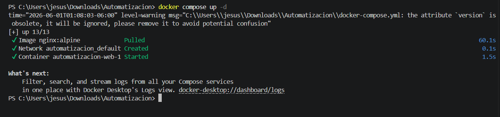
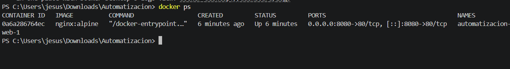

# Automatización de Infraestructura Digital
## Unidad I: Entornos de Desarrollo en la Automatización de Redes

---

<p align="center">
  
</p>

|  |  |
|-------|------|
| **Institución** | Universidad Tecnologica del Norte de Guanajuato  |
| **Carrera** | Ingeniería en Redes Inteligentes y Ciberseguridad |
| **Materia** | Automatización de Infraestructura Digital I|
| **Unidad** | Unidad I |
| **Alumno** | Jose de Jesus Lucio Tovar |
| **Número de Control** | 1223100488 |
| **Grupo** | GIRI6091 |


---

## Índice

1. [Introducción](#introducción)
2. [Desarrollo](#desarrollo)
   - [Docker Engine](#docker-engine)
   - [Docker Compose](#docker-compose)
   - [Docker Swagger](#docker-swagger)
   - [Instalación de VSCode](#instalación-de-vscode-y-plugins)
   - [Instalación de Docker](#instalación-de-docker)
   - [Instalación de Git](#instalación-de-git)
   - [Evidencias de Funcionamiento](#evidencia-de-funcionamiento)
3. [Conclusión](#conclusión)
4. [Bibliografía](#bibliografía)

---

## Introducción

El presente reporte documenta el proceso de instalación y configuración de las herramientas necesarias para llevar a cabo la automatización de infraestructura de redes, como parte del desarrollo de la Unidad I de la materia Automatización de Infraestructura Digital.

En la actualidad, la automatización de redes es una disciplina fundamental dentro del área de las Tecnologías de la Información, ya que permite reducir errores humanos, acelerar procesos de despliegue y facilitar la administración de entornos complejos. Para lograr esto, se hace uso de herramientas como Docker, Git y Visual Studio Code, las cuales en conjunto conforman un entorno de desarrollo robusto y eficiente.

Docker es una plataforma de contenedores que permite empaquetar aplicaciones junto con sus dependencias en unidades aisladas llamadas contenedores, garantizando que funcionen de manera uniforme en cualquier entorno. Docker Compose extiende esta funcionalidad permitiendo orquestar múltiples contenedores mediante archivos de configuración YAML. Por otro lado, Git es el sistema de control de versiones más utilizado en el mundo del desarrollo de software, permitiendo rastrear cambios en el código, colaborar en equipos y mantener un historial detallado de modificaciones.

Visual Studio Code es el editor de código fuente elegido para este entorno, gracias a su amplia compatibilidad con extensiones orientadas al desarrollo con contenedores, control de versiones y automatización. A lo largo de este reporte se detallará paso a paso el proceso de instalación de cada herramienta, así como las pruebas realizadas para verificar su correcto funcionamiento.

---

## Desarrollo

### Docker Engine

Docker Engine es el motor principal de la plataforma Docker. Es un runtime de contenedores de código abierto que permite construir, ejecutar y gestionar contenedores de manera eficiente. Funciona como un servicio en segundo plano (daemon) en el sistema operativo y expone una API REST a través de la cual las aplicaciones cliente pueden interactuar con él.

Sus principales características son:

- **Aislamiento:** Cada contenedor se ejecuta de forma independiente, con su propio sistema de archivos, red y procesos.
- **Portabilidad:** Las imágenes Docker pueden ejecutarse en cualquier sistema que tenga instalado Docker Engine.
- **Eficiencia:** A diferencia de las máquinas virtuales, los contenedores comparten el kernel del sistema operativo host, lo que los hace más ligeros y rápidos.
- **Escalabilidad:** Permite escalar servicios fácilmente replicando contenedores.

<p align="center">
  
</p>

---

### Docker Compose

Docker Compose es una herramienta diseñada para definir y ejecutar aplicaciones multi-contenedor. Mediante un archivo de configuración en formato YAML (`docker-compose.yml`), es posible describir todos los servicios, redes y volúmenes que conforman una aplicación y levantarlos con un solo comando.

Comandos basicos:

```shell
# Iniciar contenedores
docker compose up

# Iniciar en segundo plano
docker compose up -d

# Ver logs
docker compose logs servicio

# Detener contenedores
docker compose down
```

---

### Docker Swagger

Swagger (OpenAPI) es un conjunto de herramientas para diseñar, construir, documentar y consumir APIs REST. En Docker se puede desplegar como contenedor para visualizar y probar APIs directamente desde el navegador.

Permite:

- Documentar endpoints de una API de manera estandarizada.
- Probar peticiones HTTP directamente desde la interfaz web.
- Generar clientes y servidores automáticamente a partir de la especificación OpenAPI.

---

### Instalación de VSCode 

1. Descargar desde https://code.visualstudio.com/
2. Ejecutar el instalador y seguir el asistente.
3. Instalar extensiones con `Ctrl+Shift+X`:
   - **Docker** (Microsoft)
   - **Markdown Preview Enhanced** (Yiyi Wang)
   - **GitLens** (GitKraken)

```shell
code --version
```

<p align="center">
  
</p>

---

### Instalación de Docker

1. Descargar desde https://www.docker.com/products/docker-desktop/
2. Ejecutar el instalador y habilitar **WSL 2** en Windows.
3. Reiniciar el equipo.
4. Abrir Docker Desktop y esperar que inicie.

```shell
docker --version
```

<p align="center">
  
</p>

<p align="center">
  
</p>

---

### Instalación de Git

1. Descargar desde https://git-scm.com/download/win
2. Instalar con opciones por defecto.
3. Configurar usuario:

```shell
git config --global user.name "Tu Nombre"
git config --global user.email "tucorreo@ejemplo.com"
```

```shell
git --version
```

<p align="center">
  
</p>

---

### Evidencia de Funcionamiento

#### Docker hello-world

```shell
docker run hello-world
```

<p align="center">
  
</p>

#### Docker Compose con archivo .YML

```yaml
version: '3.8'
services:
  web:
    image: nginx:alpine
    ports:
      - "8080:80"
```

```shell
docker compose up -d
docker ps
docker compose down
```

<p align="center">
  
</p>

<p align="center">
  
</p>

---

## Conclusión


A lo largo del desarrollo de esta unidad, se logró configurar exitosamente un entorno de desarrollo orientado a la automatización de redes, compuesto por Visual Studio Code, Docker Engine, Docker Compose y Git. Cada herramienta cumple un rol específico y complementario dentro del flujo de trabajo de automatización.

La instalación de Docker permitió comprender el funcionamiento de los contenedores como unidad básica de despliegue, mientras que Docker Compose facilitó la orquestación de múltiples servicios mediante archivos YAML. Git proporcionó las bases del control de versiones necesario para gestionar el proyecto de manera organizada.

Entre los hallazgos más importantes se destaca la importancia de configurar correctamente el entorno desde etapas tempranas, ya que errores en esta fase generan conflictos difíciles de rastrear posteriormente. Este entorno constituye la base para los proyectos de automatización de las unidades subsecuentes.

---

## Bibliografía

Bell, P. (2015). *Introducing GitHub: A non-technical guide*. O'Reilly Media.

Gift, N., Behrman, K., Deza, A., & Gheorghiu, G. (2019). *Python for DevOps: Learn ruthlessly effective automation*. O'Reilly Media.

Hillar, G. C. (2016). *Building RESTful Python web services*. Packt Publishing.

Jackson, C., Murphy, C., & Santhi, V. (2020). *Cisco Certified DevNet Associate DEVASC 200-901 official cert guide*. Cisco Press.

Lenz, M. (2018). *Python continuous integration and delivery: A concise guide with examples*. Apress.

Tsitoara, M. (2019). *Beginning Git and GitHub: A comprehensive guide to version control, project management, and teamwork for the new developer*. Apress.